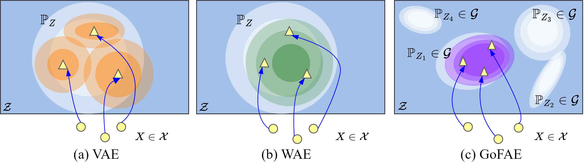

<h1 align="center">
  <b>GoFAE</b><br>
</h1>

This repo is the official Pytorch implementation for the Goodness of Fit Autoencoder (GoFAE) proposed in our ICLR 2023 paper: [Auto-Encoding Goodness of Fit](https://openreview.net/pdf?id=JjCAdMUlu9v).

**Abstract**: 
> We develop a new type of generative autoencoder called the Goodness-of-Fit Autoencoder (GoFAE), which incorporates GoF tests at two levels. At the minibatch level, it uses GoF test statistics as regularization objectives. At a more global level, it selects a regularization coefficient based on higher criticism, i.e., a test on the uniformity of the local GoF p-values. We justify the use of GoF tests by providing a relaxed $L_2$-Wasserstein bound on the distance between the latent distribution and a distribution class. We prove that optimization based on these tests can be done with stochastic gradient descent on a compact Riemannian manifold. Empirically, we show that our higher criticism parameter selection procedure balances reconstruction and generation using mutual information and uniformity of p-values respectively. Finally, we show that GoFAE achieves comparable FID scores and mean squared errors with competing deep generative models while retaining statistical indistinguishability from Gaussian in the latent space based on a variety of hypothesis tests.


Figure 1. Latent behaviors for VAE, WAE, and GoFAE inspired from Figure 1 of of Tolstikhin et al. (2017). (a) The VAE requires the approximate posterior distribution (orange contours) to match the prior $\mathbb{P}_Z$ (white contours) for each example. (b) The WAE forces the encoded distribution (green contours) to match prior $\mathbb{P}_Z$. (c) The GoFAE forces the encoded distribution (purple contours) to match some $\mathbb{P}_Z$ in the class prior $\mathcal{G}$. For illustration, several $\mathbb{P}_Z$<sub>i</sub> $\in$ $\mathcal{G}$ are visualized (white contours). 

## Table of Contents

- [Install](#install) 
- [Datasets](#datasets)
- [Usage](#usage)
- [Advanced configurations](#advanced-configurations)

### Install
All python dependencies for the GoFAE are in [`gofae_env.yml`](gofae_env.yml). Install with:

```
$ git clone https://github.com/aripalmer/gofae.git
$ cd gofae
$ conda env create -f gofae_env.yml
$ conda activate gofae_env
```

### Datasets
Experiments were performed on the MNIST, CelebA and Cifar-10 datasets. The MNIST and Cifar-10 datasets are
loaded from torchvision and stored in `../data`. The CelebA dataset can be retrieved from http://mmlab.ie.cuhk.edu.hk/projects/CelebA.html.
Place the extracted images into the folder `../data/celeba/img_align_celeba` and `list_eval_partition.csv` into `../data/celeba`.

### Usage
The following will train the GoFAE based on the example [configuration](#yaml-configuration-template) and use the higher-criticism
procedure to evaluate uniformity of p-values for model selection.
```
$ cd gofae
$ python Main.py -c configs/example.yaml
```
#### YAML training configuration template
```yaml
data_params:
  dataset: 'mnist'
     .         # Other parameters
    
gof_test_params:
  test: 'sw'
  new_stat: 'min'
  use_proj: True
  n_z: 10
  latent_dim_proj: 1
  num_projections: 10
  batch_size: 128
  alpha: 0.3
  momentum: 0.01
  lambda_alpha: 25.
  use_HT_in_loss: False
  diststat_path: '<path to null distributions>'
  
eval_tests:
  - !!python/tuple ['sw', True, 'min']
  - !!python/tuple ['sf', True, 'min']
     .
  
hc_test_params:
  test_set_samp_size: 100
  num_repeats: 30
  
trainer_params:
  epochs: 1
  train: True
     .

optim_params:
  lr_adam_enc_p1: 3.0e-3
     .

logging_params:
  seed: 42
  experiment: '<ID for experiment>'
  output_path: '<path to output directory>'
     .
```
When an appropriate $\lambda_{\alpha}$ has been found, that model can be restored and evaluated on the test set. 
To restore a trained model and evaluate, use the same yaml configuration but set the `train` parameter under `trainer_params`
to `False` and then re-run:
```
$ python Main.py -c configs/example.yaml
```
Inside `./output/experiment_<experiment>/img_output` there will be 3 images each containing a collection of the ground truth,
reconstructed and generated images.

### Advanced configurations
If a particular test configuration is unavailable it is possible to create one assuming the test statistic has been defined.
A basic configuration template is in `./configs/example_null.yaml` and can be run:
```
$ python CreateEmpiricalNull.py -c configs/example_null.yaml
```
#### YAML null creation configuration template
```yaml
diststat_path: './empirical_dist'
make_test: 'gof'

gof_test:
  n_z: 12
  batch_size: 128
  num_projections: 12
  num_sims: 100
  optdir: 1

hc_test:
  test_set_samp_size: 100
  num_sims: 100
```
#### Creating new GoF distribution
* Since the dimension of the code layer is multivariate (n_z), univariate GoF tests require projection. 
* This can be done by projecting the (batch_size $\times$ n_z)-sized minibatch onto vectors sampled
from the unit sphere. We go one step further by using an orthonormal basis (num_projections),
projecting onto each direction. The univariate GoF test is applied to each.
  * If n_z is large, then sampling an orthonormal basis of a subspace may be helpful. (i.e. num_projections \leq n_z)
  * 
* A new statistic can be created by taking the min, max or average of the (num_projections) statistics.
  * optdir: 1 if a larger test statistic leads to closer matching, -1 if a smaller test statistic leads
to closer matching. 
* The distribution of the new statistic can be approximated by repeatedly sampling (num_sims) from the null
distribution, projecting onto a random orthonormal basis, computing the new statistic, and storing the result.
* Ensure that make_test in the `example_null.yaml` is set to `gof`.

#### Creating a new uniformity distribution
* To check if a set of (test_set_samp_size) GoF test p-values are uniform, the Kolmogorov-Smirnov uniformity test is used.
* The null distribution for KS the uniformity statistic based on (test_set_samp_size) can also be simulated.
* To do so, set the number of simulations (num_sims). In the paper we used 100,000.
* Ensure that make_test in the `example_null.yaml` is set to `hc`.

Several null distributions for different configurations can be found in the ```empirical_dist``` folder.

### Citation
```
@inproceedings{palmer2023autoencoding,
  author       = {Aaron Palmer and Zhiyi Chi and Derek Aguiar and Jinbo Bi},
  title        = {Auto-Encoding Goodness of Fit},
  booktitle    = {The Eleventh International Conference on Learning Representations, {ICLR}
                  2023, Kigali, Rwanda, May 1-5, 2023},
  publisher    = {OpenReview.net},
  year         = {2023},
  url          = {https://openreview.net/forum?id=JjCAdMUlu9v},
  }
```
